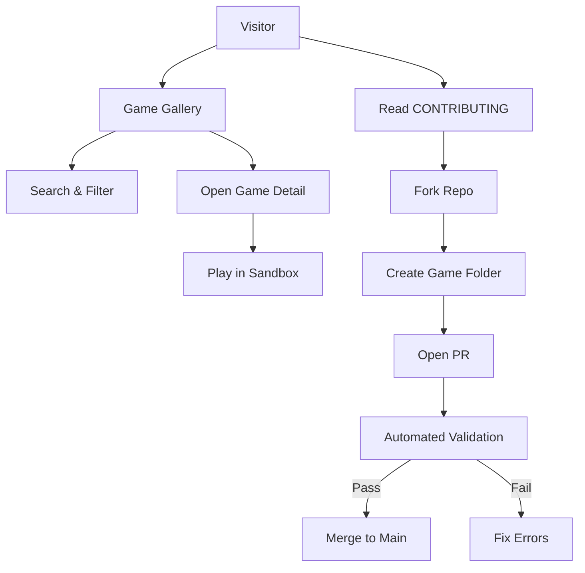
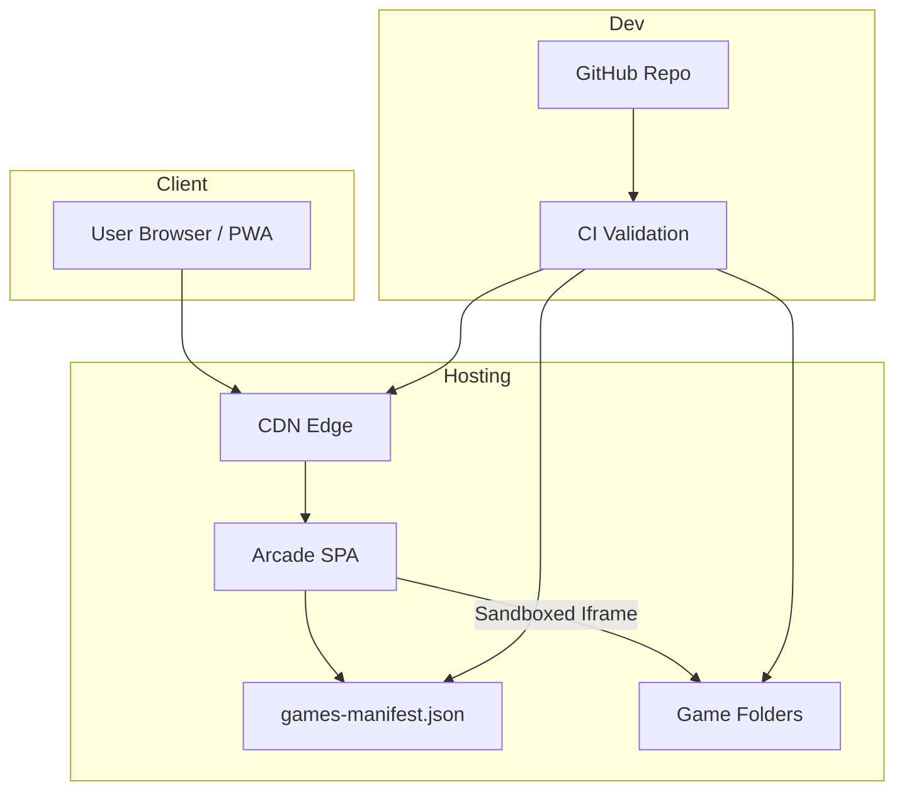

# Product Requirements Document: AI One-File Arcade

## Product Overview

**Product Vision:**
AI One-File Arcade is an open-source, security-first showcase of AI-generated, single-HTML-file web games. It provides a transparent, educational, and contributor-friendly platform where all games are created by AI models using a single prompt, stored in a structured format, and displayed through a safe sandboxed interface.

**Target Users:**

- Primary: AI tinkerers, indie developers, researchers, hackathon/game-jam participants.
- Secondary: Educators, students, tech recruiters, OSS contributors.

**Business Objectives:**

- Build a trusted, curated, AI-only game gallery.
- Grow a contributor ecosystem to encourage experimentation and education.
- Establish the platform as a reference hub for AI-generated microgames.
- Support future opportunities (e.g., sponsored jams, model comparisons, educational packs).

**Success Metrics (KPIs):**

- **Content & Community**
  - ≥ 50 AI-generated games within 6 months.
  - ≥ 30 unique contributors in first 6 months.
- **Engagement**
  - ≥ 1,000 monthly unique visitors by month 6.
  - ≥ 25% of users play multiple games per session.
  - ≥ 3-minute average gameplay session duration.
- **Quality & Safety**
  - 0 critical security failures from user-submitted content.
  - 100% of merged games pass automated validation.

---

## User Personas

### Persona 1 — Alex (AI Hobbyist Developer)

- **Demographics:** 25–35, engineering background, comfortable with AI APIs and JS.
- **Goals:**
  - Publish AI-generated game experiments.
  - Compare outputs across models (GPT, Claude, Llama, etc.).
  - Learn and refine prompting techniques.
- **Pain Points:**
  - No existing standard format for AI-generated game submissions.
  - Hard to find safe hosts for untrusted single-file HTML.
- **Journey:**
  - Discovers the arcade → plays games → inspects prompts → forks template → submits PR.

### Persona 2 — Maya (Game Jam Organizer)

- **Demographics:** 28–40, mid-level indie dev or community organizer.
- **Goals:**
  - Host AI-oriented jams with reproducible outputs.
  - Showcase participants’ creations in a safe central hub.
- **Pain Points:**
  - Existing game jam platforms lack AI transparency and sandboxing.
- **Journey:**
  - Reads contributing rules → integrates arcade in jam guidelines → submits batch of jam games.

### Persona 3 — Sam (Educator / Mentor)

- **Demographics:** 30–55, instructor or mentor with intermediate tech literacy.
- **Goals:**
  - Teach students prompt engineering + web development.
  - Use simple, single-file examples to explain concepts.
- **Pain Points:**
  - AI-generated code examples online are inconsistent or unsafe.
- **Journey:**
  - Uses tag filters for “beginner-friendly” → opens prompts → asks students to fork and remix.

---

## Feature Requirements

| Feature                                          | Description                                              | User Stories                                                           | Priority | Acceptance Criteria                                                | Dependencies  |
| ------------------------------------------------ | -------------------------------------------------------- | ---------------------------------------------------------------------- | -------- | ------------------------------------------------------------------ | ------------- |
| **F1 – Game Gallery**                            | Browse all AI-generated games with metadata.             | As a user, I want to see game cards with name, model, and description. | Must     | Search, filtering, grid display; game cards load from manifest.    | F4            |
| **F2 – Secure Game Detail & Play View**          | Show full details + load game in sandboxed iframe.       | As a user, I want to safely play games without compromising my device. | Must     | Sandboxed iframe; no access to main origin; graceful error states. | F1, F4        |
| **F3 – Contributor Flow**                        | PR-based submission with templates.                      | As a contributor, I want an easy way to add a game.                    | Must     | Template folder; CONTRIBUTING.md; correct folder structure.        | GitHub        |
| **F4 – Automated Validation & Security**         | Validate games: no POST, no tracking, allowed CDNs only. | As a maintainer, I want automated safety checks.                       | Must     | CI blocks violations; schema enforcement; no unvalidated merges.   | CI/CD         |
| **F5 – PWA / Offline Shell**                     | Installable offline shell with cached games.             | As a user, I want to play cached games offline.                        | Should   | PWA manifest; offline core pages; cache last N games.              | Hosting       |
| **F6 – Tagging & Filtering**                     | Filter by model, tags, genre, difficulty.                | As an educator, I want to find specific types of games.                | Should   | Optional fields in `info.json`; UI filters.                        | F1            |
| **F7 – Minimal Analytics (GDPR/CCPA compliant)** | Anonymous, privacy-protective analytics.                 | As a maintainer, I need usage insights without violating privacy.      | Should   | No cookies, no fingerprinting; aggregated metrics only.            | Privacy tools |
| **F8 – Documentation & Examples**                | Onboarding docs + sample games.                          | As a new visitor, I want clarity on how things work.                   | Must     | Sample games; FAQ; detailed guidelines.                            | F1–F4         |

---

## User Flows

### High-Level Flow

### Flow 1 — Browse & Play

1. User lands on gallery.
2. Searches or filters.
3. Opens Game Detail.
4. Plays game inside iframe (sandboxed).

**Errors:**

- Missing file → "Unavailable; view on GitHub."

### Flow 2 — Contribute a Game

1. User opens CONTRIBUTING.
2. Forks repo; creates `/games/<slug>/index.html`, `info.json`, and optional `prompt.md`.
3. Runs validation locally.
4. Opens PR → CI runs checks.

**Errors:**

- Disallowed CDNs, POST usage, schema issues → PR fails with clear logs.

### Flow 3 — Install PWA

1. User sees "Install app" prompt.
2. Installs PWA.
3. Re-opens PWA offline → previously viewed games available.

**Errors:**

- New game offline → "This game is not cached yet."

---

## Non-Functional Requirements

### Performance

- TTI < 2s desktop, < 4s mobile.
- Manifest fetch < 300ms p95.
- Infinite scroll optional but not required for MVP.

### Security

- Iframe sandbox (no same-origin).
- No POST, no `fetch(method: 'POST')`, no WebSockets, no EventSource.
- Only approved CDNs (jsdelivr, unpkg, cdnjs, etc.).
- No analytics inside game code.
- Validation runs pre-commit + CI.
- Security issues triaged ≤ 72 hours.

### Compatibility

- Mobile + desktop, responsive layout.
- Support latest two versions of Chrome, Firefox, Safari, Edge.
- Min viewport width: 320px.

### Accessibility

- WCAG 2.1 AA for gallery and navigation.
- Keyboard-navigable UI.
- Focus outlines, ARIA labels, high contrast.

---

## Technical Specifications (WHAT, not HOW)

### Frontend Requirements

- SPA architecture using a modern JavaScript framework (e.g., React).
- Vite bundling.
- Tailwind-based UI components.
- Dark-mode friendly.

### Backend Requirements

- No server backend.
- All content served as static files.
- `games-manifest.json` generated at build time.

### Infrastructure Requirements

- Deployed via static hosting (e.g., Netlify).
- CI enforces lint, schema validation, and security scanning.
- PR preview deployments required.

---

## Architecture Diagram

---

## Analytics & Monitoring (Strict GDPR/CCPA)

### Allowed Analytics

- Aggregate page views.
- Aggregate "game opened" events.
- PWA install count (if detectable).
- Session duration (approximate, anonymous).

### Forbidden Analytics

- Cookies
- Fingerprinting
- Cross-site tracking
- Per-user identifiers
- Any tracking inside game HTML

### Dashboards

- Traffic overview
- Top-played games
- Contributor growth

### Alerts

- Traffic anomalies
- Repeated PR security failures
- Iframe load errors > X% p95

---

## Release Planning

### MVP (v1.0)

**Includes:**

- F1 (Gallery)
- F2 (Sandbox Play)
- F3 (Contributor Flow)
- F4 (Validation)
- F8 (Docs + Examples)

**Timeline:** 3–5 weeks solo.

**MVP Success Criteria:**

- 10+ AI games added.
- 5+ external contributors.
- 0 critical security issues.

### v1.1

- PWA (F5)
- Tagging filters (F6)
- Minimal analytics (F7)

### v1.2

- Jam tagging & curated packs
- Featured games
- Accessibility improvements
- SEO enhancements

### v2.0

- AI-powered metadata assistant
- Advanced discovery (genres, difficulty ranking)
- Manual review badges (Verified)

---

## Open Questions & Assumptions (Final Answers Included)

### Final Decisions

- **AI-only platform:**
  The arcade supports only AI-generated games.
  Keeps the brand consistent and avoids scope creep.
- **Provenance:**
  Provenance is self-reported, not verified.
  Lightweight and practical for an OSS repo.
- **Analytics:**
  Must fully comply with GDPR/CCPA.
  Minimal, anonymous, cookie-less metrics only.

### Assumptions

- Contributors understand GitHub PR workflows.
- Community values security over game feature completeness.
- AI-only constraint increases clarity & appeal.
- Privacy-first approach is mandatory.

---

## Appendix

### Competitive Analysis

- **js13kGames**
  - Strong tiny-game community
  - Not AI-focused; no prompt transparency
- **itch.io**
  - Massive community
  - No AI-focused structure; no sandboxing enforcement
- **AI Game Jams**
  - Rapid experimentation
  - Scattered, not standardized, no shared security model

### User Research Insights

- Developers want safe places to publish AI-coded HTML.
- Educators need reproducible prompt → output examples.
- AI transparency is increasingly demanded.

### AI Research Insights (Summarized)

- The concept strongly aligns with emerging trends in AI + microgames.
- Sandboxing + validation is critical to safety.
- A manifest-driven, static architecture is optimal.
- Accessibility & educational use cases add long-term differentiation.

### Glossary

- **Single-file game:** AI-generated index.html game.
- **Prompt:** The exact text used to generate the game.
- **Sandbox:** HTML iframe execution with restricted privileges.
- **PWA:** Installable web app with offline shell.
- **MoSCoW:** Must / Should / Could / Won't prioritization.
